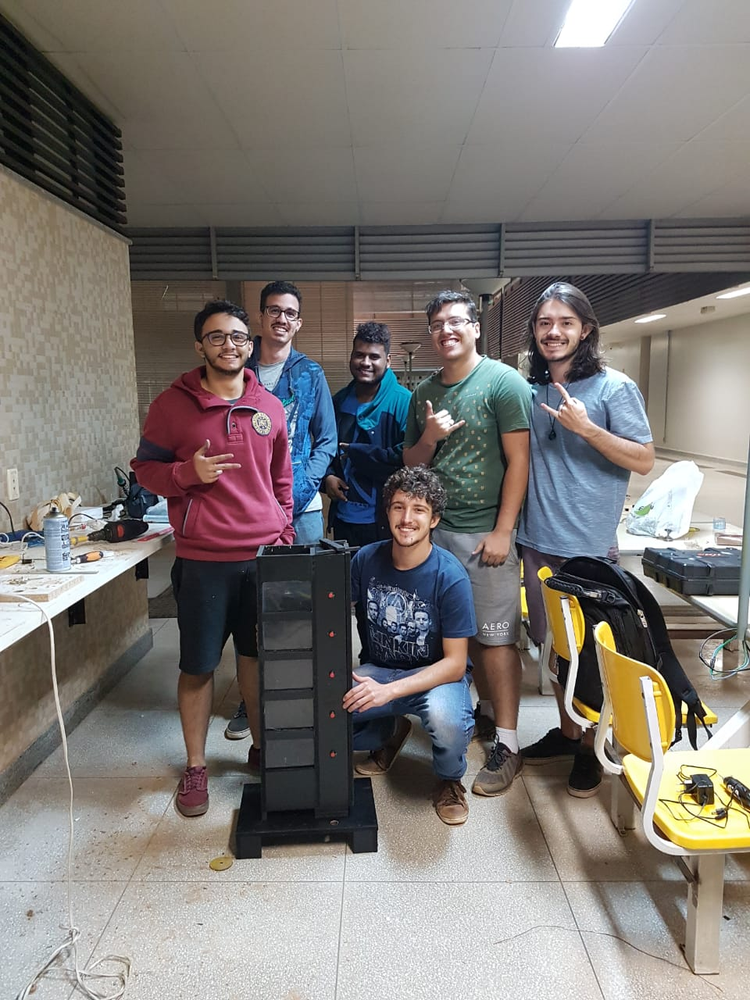

<h1 align="center">
      Controlador PID de Ar
</h1>

 Este documento é a proposta de projeto realizado na matéria projeto integrador para engenharias realizada no período 1/2019. O projeto tem o objetivo de fornecer experiências práticas aos alunos da Universidade de Brasília, da Faculdade do Gama, na matéria de Princípios de controle, por meio da utilização de um sistema didático de um elevador que seja controlado por meio da impulsão por vento, onde o aluno poderá alterar os parâmetros do controlador, alterando a resposta do sistema.

- **Descrição** O projeto consiste em um modelo de um sistema de controle de um elevador impulsionado por ar. Através do controle do sistema de ar será controlada a altura de uma dada superfície pela alternação de constantes realizada pelos alunos, será possível ter uma resposta imediata e visual às variações impostas pelo sistema de controle didaticamente.
- **Servidor Web** Essa sub área é referente a criação do Servidor WEB usando HTML, CSS, Javascript no ESP32, NodeMcu, para plotagem de gráficos em tempo real referentes à variações impostas às variáveis de controle que influenciam o sensor de distância. Nesse servidor web, os dados para plotagem dos gráficos serão fornecidas pelo Mcu através da conexão da internet e serão exibidos através de uma interface gráfica. 

## Demonstração 

      

## Página contendo o gráfico do sistema

## Alguns dos membros do projeto

<!-- ALL-CONTRIBUTORS-LIST:END -->

This project follows the [all-contributors](https://github.com/all-contributors/all-contributors) specification. Contributions of any kind welcome!
